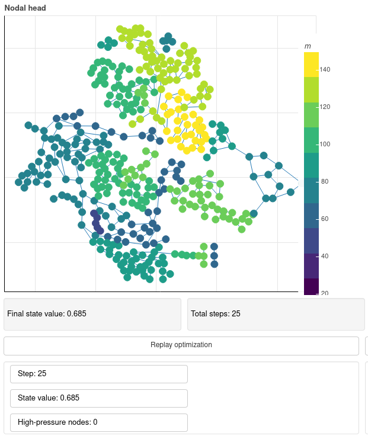

# rl-wds
RL-WDS is a framework to train agents to set optimal pump speeds in real-time in smart water distribution systems (WDSs). A fully connected dueling deep q-network observes nodal pressures and commands pumps speeds accordingly. An optimization algorithm guides the training, but the procedure allows the agent to overcome the master algorithm in performance. Pressure can be extracted from sensory data and simulation data as well. The agent does not need hydraulic simulations in the former situation; hence, the control is real-time. In the latter situation, the agent needs remarkably less hydraulic runs to reach the optimum setting even in a multi-pump WDS.

A detailed explanation is given in the paper of Hajgató, G.; Gyires-Tóth, B.; Paál, G. 2020. "Deep Reinforcement Learning for Real-Time Optimization of Pumps in Water Distribution Systems." *Journal of Water Resources Planning and Management*. 146 (11): 04020079. [10.1061/(ASCE)WR.1943-5452.0001287](https://doi.org/10.1061/(ASCE)WR.1943-5452.0001287) (or see the preprint on arXiv: [2010.06460](https://arxiv.org/abs/2010.06460)).

## Demo
A small demo highlights the benefits of the trained agents compared to a classic optimization method on two WDSs. The demo is containerized with [Docker](https://www.docker.com/). Building a local container is so simple on systems with Docker installed:

1. Clone the repository.
2. Move to the root of the local repository.
3. Invoke: `docker build -f Dockerfile --tag rlwds-demo .`.
4. Invoke: `docker run -it -p 8080:8080 --rm rlwds-demo`.

## Replicating the results
This research is conducted with reproducibility in mind. If you are interested in re-training the agents and comparing the performance published in the paper, please, use the random seeds below.

### Random seeds to replicate results
Random seed for the data generation: 67.

Random seeds for the trainings: 7, 11, 45, 67.

## Citing
### ...the paper
```
@article{Hajgato2020,
  author    = {Gergely Hajgat{\'{o}} and György Pa{\'{a}}l and B{\'{a}}lint Gyires-T{\'{o}}th},
  journal   = {Journal of Water Resources Planning and Management},
  title     = {Deep Reinforcement Learning for Real-Time Optimization of Pumps in Water Distribution Systems},
  year      = {2020},
  month     = {nov},
  number    = {11},
  pages     = {04020079},
  volume    = {146},
  doi       = {10.1061/(asce)wr.1943-5452.0001287},
  groups    = {Pressure prediction in WDS},
  publisher = {American Society of Civil Engineers ({ASCE})},
}
```

### ...the repository
```
@misc{rl-wds,
  author       = {Hajgat{\'{o}}, Gergely and Gyires-T{\'{o}}th, B{\'{a}}lint and Pa{\'{a}}l, Gy{\"{o}}rgy},
  title        = {{rl-wds}},
  year         = {2020},
  publisher    = {GitHub}
  journal      = {GitHub repository},
  organization = {SmartLab, Budapest University of Technology and Economics},
  howpublished = {\url{https://github.com/BME-SmartLab/rl-wds}},
}
```
